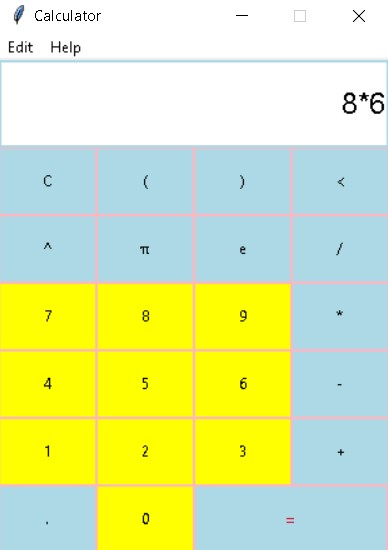

## PyCalculator🧮 

A simple and colorful calculator application built using Python and Tkinter, with button press sound effects.

## 📋 Table of Contents
- [Features](#features)
- [Screenshots](#Screenshots)
- [Installation](#Installation)
- [Sound Effects](#SoundEffects)
- [Contributing](#contributing)
- [License](#license)
- [Acknowledgements](#acknowledgements)

## Features:

- Basic arithmetic operations: addition, subtraction, multiplication, division.
- Parentheses for complex expressions.
- Power (^) and Pi (π) buttons for mathematical operations.
- Clear (C) and Delete (<) buttons to manage input.
- Error handling for invalid expressions.

## Screenshots:

## Installation:

1. **Make sure you have Python installed on your system.**
2. **Install the required dependencies:**
     - Tkinter (comes pre-installed with Python)
     - Pygame (for sound effects): pip install pygame
3. **Download or clone the repository to your local machine.**
4. **Navigate to the project directory in your terminal or command prompt.**

## SoundEffects🎶:
